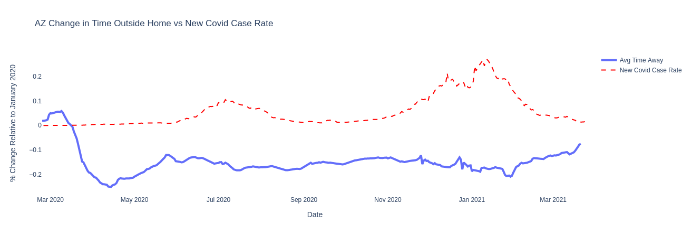

# COVID-nomics

## Motivation

COVID-19 will be the defining crisis of our decade.  There will be countless studies, analyses, and debates for years to come...and I can't wait that long.  My aim is to utilize data from a new public database, built using anonymized private sector data to examine the economic impact of COVID-19 at the National Level and at the state levels of Arizona and Colorado from the outbreak till now (3/30/21 having been the date of the data pull). I hope to provide an overview of my analysis interspersed with personal accounts during the outbreak of Covid.  

The idea behind the creation of this database can be found here:

https://opportunityinsights.org/wp-content/uploads/2020/05/tracker_paper.pdf  

The origins of the data for this project can be found here:

https://tracktherecovery.org/

## Regarding the Data  

This database provides a real-time picture of economic indicators such as employment rates, consumer spending, and job postings from varying income groups, industries and counties across the country from the outbreak of covid until now. What follows is a brief overview of the sources of data series utilized to construct the graphs and tables within this Capstone Project.  This overview is organized sequentially.

Please note that both the data and this data documentation is updated regularly and that the
following information is subject to change.

<ins>Consumer Spending Data</ins>: Aggregated purchase data from consumer credit and debit cards, based on ZIP code of cardholder.  

<ins>Employment Data</ins>: Aggregated active employee data payroll and timesheet data from multiple data providers.  

<ins>Unemployment Data</ins>: Unimployment insurance claims for all states and nation from U.S. Department of Labor.

<ins>Time Outside Home Data</ins>: Estimations using cellphone location data from Google users.

<ins>COVID-19 Data</ins>: Confirmed COVID-19 case daily counts and rates per 100,000 people from COVID Tracking Project.   

I decided to conduct my analysis in realtion to the states of Arizona and Colorado and the National Level.  The reasons for doing so is that I am a proud Arizonan and as such I am interested in the data that pertains to it, I believe that Colorado provides the closest 'apples to apples' comparison given a variety of factors, and I needed a '30,000ft. view' to contextualize my analysis of those states which the National level data provided.  

## Analysis

|                   |Yr/Yr Change in Avg Spending  |
|:------------------|-----------------------------:|
| Arizona           |         -0.00409018          |
| Colorado          |         -0.0565242           |
| National          |         -0.0111332           |

  
The above graph illustrates the Year over Year Spending differences after Covid at an Arizona, Colorado, and National Level.  

  

| AZ Avg Spending                   |Yr/Yr Change in Avg Spending|
|:----------------------------------|---------------------------:|
| Accomodation and Food Service     |         -0.286765          |
| Arts Entertain Recreaction        |         -0.426398          |
| All Spending                      |         -0.0554669         |
| Gen Merchise & Apparel            |         -0.089561          |
| Grocery and Food Store            |          0.11258           |
| Health Care and Social Assistance |         -0.0880302         |
| Transportation and Warehouse      |         -0.422075          |

  
Above we can see the Year over Year Spending differences after Covid in Arizona by Industry. Of particular note to me due to my current profession is the significant decrease in spending in the Transportation and Warehouse industry. Our company had to put on the brakes in building up our warehouse levels as we weren't quite sure how market demand was going to respond, this effectively slowed and even stopped transportation at some points.  

  

| CO Avg Spending                   |Yr/Yr Change in Avg Spending|
|:----------------------------------|---------------------------:|
| Accomodation and Food Service     |          -0.359726         |
| Arts Entertain Recreaction        |          -0.500423         |
| All Spending                      |          -0.0936864        |
| Gen Merchise & Apparel            |          -0.131            |
| Grocery and Food Store            |           0.114506         |
| Health Care and Social Assistance |          -0.151907         |
| Transportation and Warehouse      |          -0.491753         |

  

  

|                     | Yr/Yr Change in Employment |
|:--------------------|---------------------------:|
| AZ Employment       |        -0.0250228          |
| CO Employment       |        -0.0386831          |
| National Employment |        -0.0876029          |

  
The above graph illustrates the Year over Year Change in Employment after Covid at an Arizona, Colorado, and National Level. Below we can see the increase in initial claims of Pandemic Unemployment Assistance. While I did not loose my job as many did, my role and pay changed at the same time we see the major dip in employment in order to adjust to the uncertain future at the time.  

 

  

The next four graphs illustrate a possible relationship between the change in time outside the home and the rate of new Covid cases. These must be interpreted with the caveat that in order to avoid washing out or flatlining the display of the change in time outside the home when plotted with new Covid case rate, the new Covid case rate was normalized. Normalized by a factor of 1/500, given that the real rate is cases/100,000 people, equates to cases/50,000,000.    

 

  

 

  

This is an area which given more time I would have liked to investigate further by attempting to determine if there was a corelation between the change in time outside the home and the rate of new Covid cases. For example when comparing average time away from home in both the Arizona and Colorado graphs we see that Arizona residents remain at home from June onward whereas Colorado residents are away from home more often and possibly as a result we see a spike in new Covid case rates in Arizona. 

  

|    | State         |   Pop. 2019 |  Total Deaths |  Deaths per Mil |
|---:|:--------------|------------:|--------------:|----------------:|
|  1 | California    |    39512223 |         57557 |        0.057557 |
|  2 | New York      |    19453561 |         47978 |        0.047978 |
|  3 | Texas         |    28995881 |         47224 |        0.047224 |
|  4 | Florida       |    21477737 |         32727 |        0.032727 |
|  5 | Pennsylvania  |    12801989 |         24771 |        0.024771 |
|  6 | New Jersey    |     8882190 |         24170 |        0.02417  |
|  7 | Illinois      |    12671821 |         22902 |        0.022902 |
|  8 | Georgia       |    10617423 |         17959 |        0.017959 |
|  9 | Massachusetts |     6892503 |         16855 |        0.016855 |
| 10 | Arizona       |     7278717 |         16739 |        0.016739 |

  
Shown above are Covid deaths per million in the United States.

  

|    | Arizona Counties  |  Total Deaths | Colorado Counties  |  Total Deaths |
|---:|:------------------|--------------:|:-------------------|--------------:|
|  1 | Maricopa          |          9542 | Denver             |           775 |
|  2 | Pima              |          2327 | El Paso            |           754 |
|  3 | Pinal             |           833 | Jefferson          |           729 |
|  4 | Yuma              |           811 | Arapahoe           |           676 |
|  5 | Mohave            |           674 | Adams              |           633 |

  
Lastly, we see above the total deaths in Arizona and Colorado counties relative to a log 10 scale.

## Concluding Thoughts

As mentioned earlier I would have liked to look into whether there was a correlation between the change in time outside the home and the rate of new Covid cases. The time away from home data can be broken down into 7 categories where that time away from home is spent. Examining where time spent away from home and rates of new Covid cases could provide additional insight.

Additionally, the level of economic analysis herein was surface level. As data exists for changes of employment by income level, referencing that against changes in spending might have provided insight into the behaviors of various income strata. 

Finally, their seems to be a substantial difference in total deaths between Arizona and Colorado. Of singular importance are determining the factors that lead to the difference. There could be numerous factors but one in particular that might provide insight is diving into the Covid data as it relates to Native American tribal communites, a dive which would require acquing data outside of this particular set.

## Contact Info

   LinkedIn: 
    
   https://www.linkedin.com/in/robert-bobby-huck-1b4b62114/

   GitHub:
    
   https://github.com/Rhuck1
    
   Email:
    
   bobbyhuck@gmail.com
    

