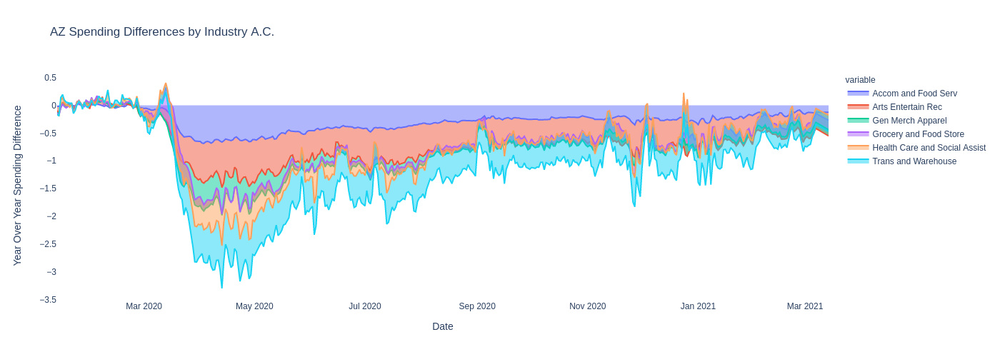

# COVID-nomics

## Motivation

COVID-19 will be the defining crisis of our decade.  There will be countless studies, analyses, and debates for years to come...and I can't wait that long.  My aim is to utilize data from a new public database, built using anonymized private sector data to examine the economic impact of COVID-19 here in the US from the outbreak till now (3/30/21 having been the date of the data pull).  This database provides a real-time picture of economic indicators such as employment rates, consumer spending, and job postings from varying income groups, industries and counties across the country from the outbreak of covid until now. I hope to provide an overview of my analysis interspersed with personal accounts during the outbreak of Covid.  

The idea behind the creation of this database can be found here:

https://opportunityinsights.org/wp-content/uploads/2020/05/tracker_paper.pdf  

The origins of the data for this project can be found here:

https://tracktherecovery.org/

## Regarding the Data
This section provides a brief overview of the sources and processing applied to each data series utilized to construct the graphs and tables within this Capstone Project.  This overview is organized sequentially.

Please note that both the data and this data documentation is updated regularly and that the
following information is subject to change.

I decided to conduct my analysis in realtion to the states of Arizona and Colorado and the National Level.  The reasons for doing so is that I am a proud Arizonan and as such I am interested in the data that pertains to it, I believe that Colorado provides the closest 'apples to apples' comparison given a variety of factors, and I needed a '30,000ft. view' to contextualize my analysis of those states which the National level data provided.  

***This section should also include EDA graphs***

## Analysis

|                   |Mean Spend Yr/Yr  |
|:------------------|-----------------:|
| Arizona           |   -0.00409018    |
| Colorado          |   -0.0565242     |
| National          |   -0.0111332     |

  
The above graph illustrates the Year over Year Spending differences after Covid at an Arizona, Colorado, and National Level.  

  

| AZ Avg Spending                   |    Yr/Yr   |
|:----------------------------------|-----------:|
| Accomodation and Food Service     | -0.286765  |
| Arts Entertain Recreaction        | -0.426398  |
| All Spending                      | -0.0554669 |
| Gen Merchise & Apparel            | -0.089561  |
| Grocery and Food Store            |  0.11258   |
| Health Care and Social Assistance | -0.0880302 |
| Transportation and Warehouse      | -0.422075  |

  
Above we can see the Year over Year Spending differences after Covid in Arizona by Industry. Of particular note to me due to my current profession is the significant decrease in spending in the Transportation and Warehouse industry. Our company had to put on the brakes in building up our warehouse levels as we weren't quite sure how market demand was going to respond, this effectively slowed and even stopped transportation at some points.  

  

| CO Avg Spending                   |    Yr/Yr   |
|:----------------------------------|-----------:|
| Accomodation and Food Service     | -0.359726  |
| Arts Entertain Recreaction        | -0.500423  |
| All Spending                      | -0.0936864 |
| Gen Merchise & Apparel            | -0.131     |
| Grocery and Food Store            |  0.114506  |
| Health Care and Social Assistance | -0.151907  |
| Transportation and Warehouse      | -0.491753  |

  

  

|                     | Yr/Yr Change in Employment |
|:--------------------|---------------------------:|
| AZ Employment       |        -0.0250228          |
| CO Employment       |        -0.0386831          |
| National Employment |        -0.0876029          |

  
The above graph illustrates the Year over Year Change in Employment after Covid at an Arizona, Colorado, and National Level. Below we can see the increase in initial claims of Pandemic Unemployment Assistance. While I did not loose my job as many did, my role and pay changed at the same time we see the major dip in employment in order to adjust to the uncertain future at the time.  

 

  

## Concluding Thoughts

## Contact Info

   LinkedIn: 
    
   https://www.linkedin.com/in/robert-bobby-huck-1b4b62114/

   GitHub:
    
   https://github.com/Rhuck1
    
   Email:
    
   bobbyhuck@gmail.com
    

